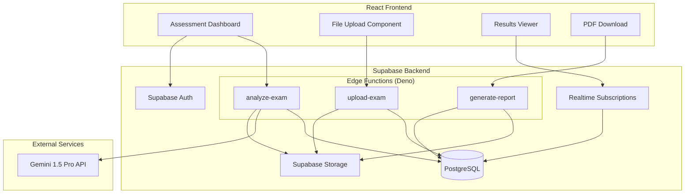
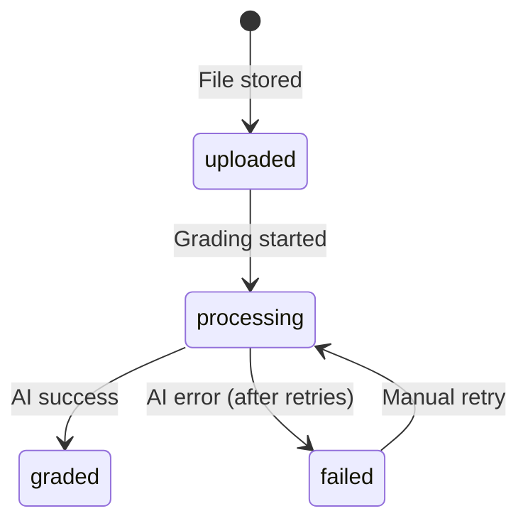

# Design Document: EducaSol Automated Assessment

## Overview

The Automated Assessment feature extends EducaSol's capabilities from content generation to intelligent exam evaluation. The system leverages Google Gemini 1.5 Pro's multimodal AI to process scanned handwritten exams, extract student responses through OCR, evaluate answers against educator-defined rubrics, and generate verifiable PDF reports.

The architecture follows EducaSol's existing patterns: React frontend with TypeScript, Supabase backend (PostgreSQL + Edge Functions on Deno), and integration with AI services. The feature introduces new database tables (exams, submissions, results), new Edge Functions (upload-exam, analyze-exam, generate-report), and new React components for the assessment dashboard.

## Architecture



### Data Flow

1. **Upload Flow**: Educator uploads PDF → Edge Function validates → Stores in Supabase Storage → Creates submission record
2. **Grading Flow**: Trigger analyze → Fetch PDF from Storage → Convert to Base64 → Send to Gemini with rubric → Parse JSON response → Store result
3. **Report Flow**: Request PDF → Fetch result from DB → Generate QR code → Render React-PDF → Store and return binary

## Components and Interfaces

### Edge Functions

#### 1. upload-exam

```typescript
// POST /functions/v1/upload-exam
// Content-Type: multipart/form-data

interface UploadExamRequest {
  file: File;           // PDF, JPEG, or PNG
  exam_id: string;      // UUID of the exam
  student_identifier?: string;  // Optional student name/ID
}

interface UploadExamResponse {
  submission_id: string;
  storage_path: string;
  status: 'uploaded';
}
```

#### 2. analyze-exam

```typescript
// POST /functions/v1/analyze-exam
// Content-Type: application/json

interface AnalyzeExamRequest {
  submission_id: string;
}

interface AnalyzeExamResponse {
  result_id: string;
  total_score: number;
  status: 'graded' | 'failed';
  ai_output: GradingResult;
}
```

#### 3. generate-report

```typescript
// POST /functions/v1/generate-report
// Content-Type: application/json

interface GenerateReportRequest {
  result_id: string;
}

interface GenerateReportResponse {
  pdf_url: string;
  verification_token: string;
}
```

### React Components

#### AssessmentDashboard
Main container component displaying exam list, submission status, and grading results.

#### ExamCreator
Form component for creating exams with title, description, class selection, and rubric builder.

#### FileUploader
Drag-and-drop component supporting bulk PDF/image uploads with progress indicators.

#### SubmissionList
Table component showing all submissions for an exam with status badges and score display.

#### ResultViewer
Detailed view of AI grading output including transcriptions, feedback, and score breakdown.

#### VerificationPage
Public page for QR code verification displaying limited grade information.

### Grading Result Schema (Gemini Output)

```typescript
interface GradingResult {
  student_metadata: {
    name: string;
    student_id: string;
    handwriting_quality: 'excellent' | 'good' | 'poor' | 'illegible';
  };
  questions: QuestionResult[];
  summary_comment: string;
  total_score: number;
}

interface QuestionResult {
  number: string;
  topic: string;
  student_response_transcription: string;
  is_correct: boolean;
  points_awarded: number;
  max_points: number;
  reasoning: string;
  feedback_for_student: string;
}
```

### Rubric Schema (Educator Input)

```typescript
interface Rubric {
  title: string;
  total_points: number;
  questions: RubricQuestion[];
  grading_instructions?: string;
}

interface RubricQuestion {
  number: string;
  topic: string;
  max_points: number;
  expected_answer?: string;
  partial_credit_criteria?: string[];
  keywords?: string[];
}
```

## Data Models

### Database Schema Extensions

```sql
-- Table: exams
CREATE TABLE public.exams (
  id UUID DEFAULT uuid_generate_v4() PRIMARY KEY,
  educator_id UUID REFERENCES public.profiles(id) NOT NULL,
  school_id UUID REFERENCES public.schools(id) NOT NULL,
  class_id UUID REFERENCES public.classes(id),
  title TEXT NOT NULL,
  description TEXT,
  rubric JSONB NOT NULL,
  status TEXT CHECK (status IN ('draft', 'published', 'archived')) DEFAULT 'draft',
  created_at TIMESTAMPTZ DEFAULT NOW(),
  updated_at TIMESTAMPTZ DEFAULT NOW()
);

-- Table: submissions
CREATE TABLE public.submissions (
  id UUID DEFAULT uuid_generate_v4() PRIMARY KEY,
  exam_id UUID REFERENCES public.exams(id) NOT NULL,
  student_identifier TEXT,
  storage_path TEXT NOT NULL,
  file_type TEXT CHECK (file_type IN ('pdf', 'jpeg', 'png')) NOT NULL,
  file_size_bytes INTEGER NOT NULL,
  status TEXT CHECK (status IN ('uploaded', 'processing', 'graded', 'failed')) DEFAULT 'uploaded',
  error_message TEXT,
  uploaded_at TIMESTAMPTZ DEFAULT NOW(),
  processed_at TIMESTAMPTZ
);

-- Table: results
CREATE TABLE public.results (
  id UUID DEFAULT uuid_generate_v4() PRIMARY KEY,
  submission_id UUID REFERENCES public.submissions(id) UNIQUE NOT NULL,
  ai_output JSONB NOT NULL,
  total_score NUMERIC GENERATED ALWAYS AS ((ai_output->>'total_score')::numeric) STORED,
  pdf_report_url TEXT,
  verification_token UUID DEFAULT uuid_generate_v4(),
  graded_at TIMESTAMPTZ DEFAULT NOW()
);

-- Indexes for performance
CREATE INDEX idx_exams_educator ON public.exams(educator_id);
CREATE INDEX idx_exams_school ON public.exams(school_id);
CREATE INDEX idx_submissions_exam ON public.submissions(exam_id);
CREATE INDEX idx_submissions_status ON public.submissions(status);
CREATE INDEX idx_results_verification ON public.results(verification_token);

-- RLS Policies
ALTER TABLE public.exams ENABLE ROW LEVEL SECURITY;
ALTER TABLE public.submissions ENABLE ROW LEVEL SECURITY;
ALTER TABLE public.results ENABLE ROW LEVEL SECURITY;

-- Educators can manage their own exams
CREATE POLICY "Educators manage own exams" ON public.exams
  FOR ALL USING (auth.uid() = educator_id);

-- School admins can view all exams in their school
CREATE POLICY "School admins view school exams" ON public.exams
  FOR SELECT USING (
    school_id IN (
      SELECT school_id FROM public.profiles WHERE id = auth.uid()
    )
  );

-- Submissions follow exam access
CREATE POLICY "Access submissions via exam" ON public.submissions
  FOR ALL USING (
    exam_id IN (SELECT id FROM public.exams WHERE educator_id = auth.uid())
  );

-- Results follow submission access
CREATE POLICY "Access results via submission" ON public.results
  FOR ALL USING (
    submission_id IN (
      SELECT s.id FROM public.submissions s
      JOIN public.exams e ON s.exam_id = e.id
      WHERE e.educator_id = auth.uid()
    )
  );
```

### Storage Buckets

```
raw-exams/
  └── user_{educator_id}/
      └── exam_{exam_id}/
          └── {timestamp}_{filename}.pdf

graded-reports/
  └── {result_id}.pdf
```


## Correctness Properties

*A property is a characteristic or behavior that should hold true across all valid executions of a system-essentially, a formal statement about what the system should do. Properties serve as the bridge between human-readable specifications and machine-verifiable correctness guarantees.*

### Property 1: Exam creation stores all required fields
*For any* valid exam input (title, description, rubric, class_id), creating an exam and then retrieving it should return an object with all the same field values.
**Validates: Requirements 1.1**

### Property 2: Rubric validation correctness
*For any* rubric object, the validation function should accept rubrics containing question definitions with point allocations, and reject rubrics missing these required elements.
**Validates: Requirements 1.2**

### Property 3: Exam updates preserve submissions
*For any* exam with existing submissions, updating the exam's metadata (title, description) should not affect the count or content of associated submissions.
**Validates: Requirements 1.3**

### Property 4: File type validation
*For any* file upload attempt, the system should accept files with MIME types application/pdf, image/jpeg, or image/png, and reject all other MIME types.
**Validates: Requirements 2.1**

### Property 5: File size validation
*For any* file upload attempt, the system should accept files with size ≤ 10MB and reject files exceeding 10MB.
**Validates: Requirements 2.2**

### Property 6: Storage path structure
*For any* successful file upload, the resulting storage_path should match the pattern `user_{educator_id}/exam_{exam_id}/{timestamp}_{filename}` where all IDs are valid UUIDs.
**Validates: Requirements 2.3**

### Property 7: Upload creates submission record
*For any* successful file upload, a submission record should exist with the correct storage_path, file_type, file_size_bytes, and status set to 'uploaded'.
**Validates: Requirements 2.4**

### Property 8: Base64 conversion round-trip
*For any* valid PDF or image file, converting to Base64 and then decoding back should produce identical binary content.
**Validates: Requirements 3.1**

### Property 9: Grading result schema validation
*For any* grading result object, it must contain student_metadata (with name, student_id, handwriting_quality), a questions array (each with number, topic, student_response_transcription, is_correct, points_awarded, max_points, reasoning, feedback_for_student), summary_comment, and total_score.
**Validates: Requirements 4.1, 4.2, 4.3**

### Property 10: Grading result serialization round-trip
*For any* valid GradingResult object, serializing to JSON and deserializing back should produce an equivalent object with all fields preserved.
**Validates: Requirements 4.4, 4.5**

### Property 11: PDF report contains required content
*For any* grading result, the generated PDF should contain the student name, exam title, total score, and a QR code that decodes to a valid verification URL containing the verification_token.
**Validates: Requirements 5.1, 5.2, 5.3**

### Property 12: QR code verification retrieves correct data
*For any* valid verification_token, querying the verification endpoint should return the correct student initials, exam title, graded date, and total score matching the original result.
**Validates: Requirements 6.1, 6.2, 6.3**

### Property 13: Access control returns only authorized data
*For any* authenticated user querying exams, the result set should contain only exams where the user is the educator or belongs to the same school, and should never include exams from other schools.
**Validates: Requirements 7.1, 7.3, 7.4**

### Property 14: Dashboard aggregation correctness
*For any* educator's exam list, the displayed submission counts and status summaries should match the actual count of submissions in each status for each exam.
**Validates: Requirements 8.1, 8.3**

### Property 15: Filter results correctness
*For any* filter criteria (status, score range), the filtered submission list should contain exactly the submissions matching all specified criteria and no others.
**Validates: Requirements 8.5**

## Error Handling

### Edge Function Errors

| Error Type | HTTP Status | Response | Recovery |
|------------|-------------|----------|----------|
| Missing auth header | 401 | `{ error: "Missing authorization header" }` | Redirect to login |
| Invalid file type | 400 | `{ error: "Invalid file type", allowed: ["pdf", "jpeg", "png"] }` | Show validation message |
| File too large | 400 | `{ error: "File exceeds 10MB limit", size: actual_size }` | Show size limit message |
| Gemini API timeout | 503 | `{ error: "Grading service temporarily unavailable" }` | Retry with backoff |
| Gemini API error | 502 | `{ error: "AI service error", details: message }` | Log and mark failed |
| Invalid rubric | 400 | `{ error: "Invalid rubric", details: validation_errors }` | Show form errors |
| Storage error | 500 | `{ error: "Storage operation failed" }` | Retry or show error |

### Retry Strategy

```typescript
const RETRY_CONFIG = {
  maxAttempts: 3,
  baseDelayMs: 1000,
  maxDelayMs: 10000,
  backoffMultiplier: 2,
};

async function withRetry<T>(
  operation: () => Promise<T>,
  config = RETRY_CONFIG
): Promise<T> {
  let lastError: Error;
  for (let attempt = 1; attempt <= config.maxAttempts; attempt++) {
    try {
      return await operation();
    } catch (error) {
      lastError = error as Error;
      if (attempt < config.maxAttempts) {
        const delay = Math.min(
          config.baseDelayMs * Math.pow(config.backoffMultiplier, attempt - 1),
          config.maxDelayMs
        );
        await new Promise(resolve => setTimeout(resolve, delay));
      }
    }
  }
  throw lastError!;
}
```

### Status Transitions



## Testing Strategy

### Dual Testing Approach

This feature requires both unit tests and property-based tests to ensure comprehensive coverage:

- **Unit tests** verify specific examples, edge cases, and integration points
- **Property-based tests** verify universal properties that should hold across all valid inputs

### Property-Based Testing Framework

**Library**: fast-check (npm:fast-check)

fast-check is chosen for its TypeScript support, excellent shrinking capabilities, and compatibility with the existing test infrastructure.

**Configuration**:
```typescript
import fc from 'fast-check';

// Run 100 iterations minimum per property
fc.configureGlobal({ numRuns: 100 });
```

### Test Organization

```
src/
  lib/
    assessment/
      __tests__/
        rubric.test.ts           # Unit tests for rubric validation
        rubric.property.test.ts  # Property tests for rubric validation
        grading.test.ts          # Unit tests for grading logic
        grading.property.test.ts # Property tests for grading
        storage.test.ts          # Unit tests for storage operations
        storage.property.test.ts # Property tests for storage paths
        pdf.test.ts              # Unit tests for PDF generation
        pdf.property.test.ts     # Property tests for PDF content
```

### Property Test Annotations

Each property-based test must be annotated with the correctness property it implements:

```typescript
/**
 * **Feature: automated-assessment, Property 2: Rubric validation correctness**
 * **Validates: Requirements 1.2**
 */
test('rubric validation accepts valid rubrics and rejects invalid ones', () => {
  fc.assert(
    fc.property(arbitraryRubric(), (rubric) => {
      const result = validateRubric(rubric);
      // Property assertion
    })
  );
});
```

### Test Generators (Arbitraries)

```typescript
// Arbitrary for valid rubric questions
const arbitraryRubricQuestion = (): fc.Arbitrary<RubricQuestion> =>
  fc.record({
    number: fc.stringOf(fc.constantFrom('1', '2', '3', '4', '5'), { minLength: 1, maxLength: 3 }),
    topic: fc.string({ minLength: 1, maxLength: 100 }),
    max_points: fc.integer({ min: 1, max: 100 }),
    expected_answer: fc.option(fc.string({ maxLength: 500 })),
    partial_credit_criteria: fc.option(fc.array(fc.string({ maxLength: 200 }), { maxLength: 5 })),
    keywords: fc.option(fc.array(fc.string({ maxLength: 50 }), { maxLength: 10 })),
  });

// Arbitrary for valid rubrics
const arbitraryValidRubric = (): fc.Arbitrary<Rubric> =>
  fc.record({
    title: fc.string({ minLength: 1, maxLength: 200 }),
    total_points: fc.integer({ min: 1, max: 1000 }),
    questions: fc.array(arbitraryRubricQuestion(), { minLength: 1, maxLength: 50 }),
    grading_instructions: fc.option(fc.string({ maxLength: 1000 })),
  });

// Arbitrary for grading results
const arbitraryGradingResult = (): fc.Arbitrary<GradingResult> =>
  fc.record({
    student_metadata: fc.record({
      name: fc.string({ minLength: 1, maxLength: 100 }),
      student_id: fc.string({ minLength: 1, maxLength: 50 }),
      handwriting_quality: fc.constantFrom('excellent', 'good', 'poor', 'illegible'),
    }),
    questions: fc.array(arbitraryQuestionResult(), { minLength: 1, maxLength: 50 }),
    summary_comment: fc.string({ maxLength: 500 }),
    total_score: fc.float({ min: 0, max: 1000 }),
  });

// Arbitrary for file uploads
const arbitraryValidFileUpload = (): fc.Arbitrary<{ type: string; size: number; name: string }> =>
  fc.record({
    type: fc.constantFrom('application/pdf', 'image/jpeg', 'image/png'),
    size: fc.integer({ min: 1, max: 10 * 1024 * 1024 }), // Up to 10MB
    name: fc.string({ minLength: 1, maxLength: 100 }).map(s => s.replace(/[^a-zA-Z0-9]/g, '_') + '.pdf'),
  });
```

### Unit Test Coverage

| Component | Test Focus |
|-----------|------------|
| Rubric validation | Schema validation, required fields, point calculations |
| File upload | MIME type detection, size limits, path generation |
| Grading engine | Prompt construction, response parsing, error handling |
| PDF generation | Content inclusion, QR code embedding, layout |
| Verification | Token lookup, data display, invalid token handling |
| Access control | RLS policy enforcement, cross-school isolation |
