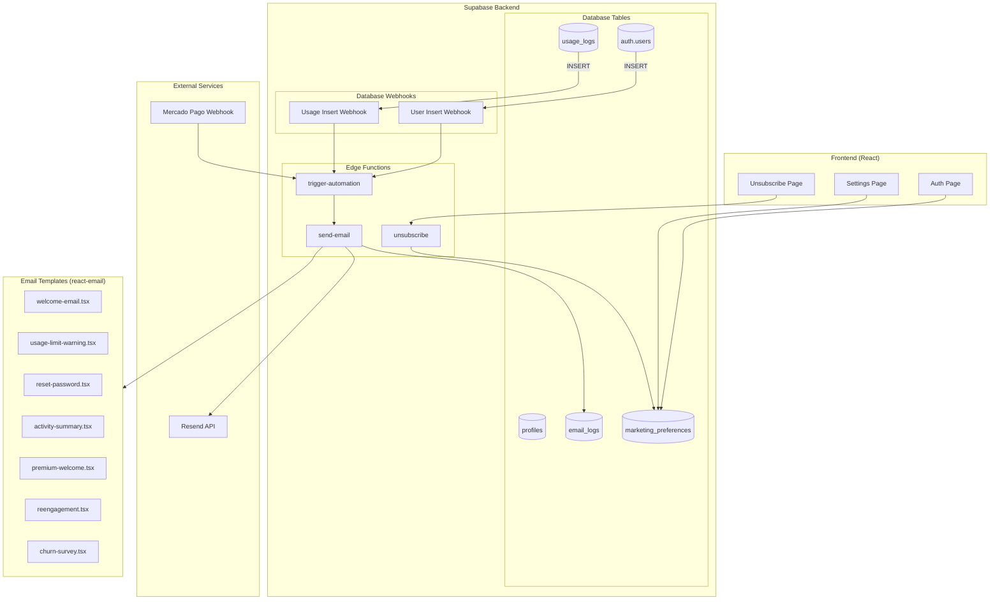

# Design Document: Sistema de Email e Automação de Engajamento

## Overview

O sistema de email do Educa Sol é uma extensão da experiência do produto, atuando como um "concierge" que guia o usuário através de sua jornada na plataforma. Utiliza Resend como provedor de email, react-email para templates, e Supabase Edge Functions para automações.

A arquitetura é serverless e event-driven, com triggers de banco de dados disparando automações em tempo real. O sistema respeita a LGPD com gestão granular de preferências de comunicação.

## Architecture



## Components and Interfaces

### 1. Email Service (Edge Function: send-email)

```typescript
interface SendEmailRequest {
  to: string;
  templateId: EmailTemplate;
  data: Record<string, unknown>;
  userId?: string;
  attachments?: Attachment[];
}

interface SendEmailResponse {
  success: boolean;
  messageId?: string;
  error?: string;
}

type EmailTemplate = 
  | 'welcome'
  | 'usage-warning-80'
  | 'usage-warning-100'
  | 'usage-followup'
  | 'reset-password'
  | 'premium-welcome'
  | 'payment-failed'
  | 'activity-summary'
  | 'reengagement'
  | 'churn-survey'
  | 'onboarding-day1'
  | 'onboarding-day3';

interface Attachment {
  filename: string;
  content: Buffer;
  contentType: string;
}
```

### 2. Automation Engine (Edge Function: trigger-automation)

```typescript
interface AutomationTrigger {
  event: AutomationEvent;
  userId: string;
  payload: Record<string, unknown>;
  timestamp: string;
}

type AutomationEvent = 
  | 'user.created'
  | 'usage.threshold_80'
  | 'usage.threshold_100'
  | 'payment.confirmed'
  | 'payment.failed'
  | 'subscription.cancelled'
  | 'user.inactive_14d'
  | 'weekly.summary';

interface AutomationRule {
  event: AutomationEvent;
  conditions: Condition[];
  action: AutomationAction;
  cooldownDays?: number;
}

interface AutomationAction {
  type: 'send_email';
  templateId: EmailTemplate;
  delayMinutes?: number;
}
```

### 3. Marketing Preferences Service

```typescript
interface MarketingPreferences {
  userId: string;
  lgpdConsent: boolean;
  newsletter: boolean;
  productUpdates: boolean;
  createdAt: string;
  updatedAt: string;
}

interface UpdatePreferencesRequest {
  lgpdConsent?: boolean;
  newsletter?: boolean;
  productUpdates?: boolean;
}
```

### 4. Template Renderer

```typescript
interface TemplateProps {
  userName?: string;
  [key: string]: unknown;
}

interface WelcomeEmailProps extends TemplateProps {
  tutorialUrl: string;
}

interface UsageWarningProps extends TemplateProps {
  usagePercent: number;
  planName: string;
  upgradeUrl: string;
}

interface ActivitySummaryProps extends TemplateProps {
  plansCreated: number;
  activitiesGenerated: number;
  assessmentsCreated: number;
  weekStartDate: string;
  weekEndDate: string;
}
```

## Data Models

### email_logs Table

```sql
CREATE TABLE email_logs (
  id UUID PRIMARY KEY DEFAULT gen_random_uuid(),
  user_id UUID REFERENCES auth.users(id) ON DELETE CASCADE,
  template_id TEXT NOT NULL,
  recipient_email TEXT NOT NULL,
  subject TEXT NOT NULL,
  status TEXT NOT NULL CHECK (status IN ('sent', 'failed', 'bounced', 'delivered', 'opened', 'clicked')),
  resend_message_id TEXT,
  error_message TEXT,
  metadata JSONB DEFAULT '{}',
  sent_at TIMESTAMPTZ DEFAULT NOW(),
  created_at TIMESTAMPTZ DEFAULT NOW()
);

CREATE INDEX idx_email_logs_user_id ON email_logs(user_id);
CREATE INDEX idx_email_logs_template_id ON email_logs(template_id);
CREATE INDEX idx_email_logs_sent_at ON email_logs(sent_at);
```

### marketing_preferences Table

```sql
CREATE TABLE marketing_preferences (
  id UUID PRIMARY KEY DEFAULT gen_random_uuid(),
  user_id UUID UNIQUE REFERENCES auth.users(id) ON DELETE CASCADE,
  lgpd_consent BOOLEAN DEFAULT FALSE,
  newsletter BOOLEAN DEFAULT FALSE,
  product_updates BOOLEAN DEFAULT FALSE,
  unsubscribed_at TIMESTAMPTZ,
  created_at TIMESTAMPTZ DEFAULT NOW(),
  updated_at TIMESTAMPTZ DEFAULT NOW()
);

CREATE INDEX idx_marketing_preferences_user_id ON marketing_preferences(user_id);
```

### automation_queue Table (para emails com delay)

```sql
CREATE TABLE automation_queue (
  id UUID PRIMARY KEY DEFAULT gen_random_uuid(),
  user_id UUID REFERENCES auth.users(id) ON DELETE CASCADE,
  template_id TEXT NOT NULL,
  scheduled_for TIMESTAMPTZ NOT NULL,
  status TEXT NOT NULL CHECK (status IN ('pending', 'sent', 'cancelled')),
  payload JSONB DEFAULT '{}',
  created_at TIMESTAMPTZ DEFAULT NOW()
);

CREATE INDEX idx_automation_queue_scheduled ON automation_queue(scheduled_for) WHERE status = 'pending';
```

## Correctness Properties

*A property is a characteristic or behavior that should hold true across all valid executions of a system—essentially, a formal statement about what the system should do. Properties serve as the bridge between human-readable specifications and machine-verifiable correctness guarantees.*

### Property 1: Email Logging Completeness
*For any* email sent through the Email_Service, there SHALL exist a corresponding record in email_logs with matching user_id, template_id, and timestamp within 1 second of the send operation.
**Validates: Requirements 1.2, 5.5**

### Property 2: Session Validation for Authenticated Emails
*For any* request to send an authenticated email without a valid session, the Email_Service SHALL reject the request and NOT send the email.
**Validates: Requirements 1.3**

### Property 3: Marketing Preferences Default Values
*For any* newly created user, there SHALL exist a marketing_preferences record with lgpd_consent=false, newsletter=false, and product_updates=false.
**Validates: Requirements 2.1**

### Property 4: Marketing Email Unsubscribe Link
*For any* email template classified as marketing or notification, the rendered HTML SHALL contain an unsubscribe link with a valid token.
**Validates: Requirements 2.4**

### Property 5: Transactional Email Content Purity
*For any* email template classified as transactional, the rendered HTML SHALL NOT contain promotional content, upgrade CTAs, or marketing messages.
**Validates: Requirements 2.6**

### Property 6: Template HTML Validity
*For any* email template rendered by Template_Renderer, the output SHALL be valid HTML that passes W3C validation for email clients.
**Validates: Requirements 3.2**

### Property 7: Inline Styles Application
*For any* email template rendered by Template_Renderer, all CSS styles SHALL be inlined in the HTML elements (no external stylesheets or style tags).
**Validates: Requirements 3.3**

### Property 8: Usage Alert at 80% Threshold
*For any* user whose usage reaches exactly 80% of their plan limit, the Usage_Monitor SHALL trigger a usage-warning-80 email within 5 minutes, provided no similar email was sent in the last 7 days.
**Validates: Requirements 5.1, 5.4**

### Property 9: Usage Alert at 100% Threshold
*For any* user whose usage reaches 100% of their plan limit, the Usage_Monitor SHALL trigger a usage-warning-100 email within 5 minutes, provided no similar email was sent in the last 7 days.
**Validates: Requirements 5.2, 5.4**

### Property 10: Welcome Email on Registration
*For any* newly registered user with lgpd_consent=true, the Automation_Engine SHALL send a welcome email within 1 minute of registration.
**Validates: Requirements 6.1**

### Property 11: Marketing Preferences Respect
*For any* email classified as marketing or notification, the system SHALL NOT send the email if the user's corresponding marketing_preferences flag is false.
**Validates: Requirements 6.4, 7.3, 9.3**

### Property 12: Activity Summary Content Completeness
*For any* activity-summary email, the rendered content SHALL include plansCreated, activitiesGenerated, and assessmentsCreated values that match the user's actual activity in the specified week.
**Validates: Requirements 9.2**

### Property 13: Inactive User Summary Suppression
*For any* user with zero activity in a given week, the system SHALL NOT send an activity-summary email for that week.
**Validates: Requirements 9.4**

### Property 14: Edge Function Payload Validation
*For any* payload received by trigger-automation Edge Function, the function SHALL validate the payload schema before processing and reject invalid payloads with appropriate error response.
**Validates: Requirements 11.4**

### Property 15: Automation Condition Execution
*For any* automation trigger where all conditions are met, the Edge Function SHALL invoke send-email with the correct template and parameters.
**Validates: Requirements 11.5**

## Error Handling

### Email Sending Failures

```typescript
interface EmailError {
  code: 'INVALID_RECIPIENT' | 'RATE_LIMITED' | 'TEMPLATE_ERROR' | 'API_ERROR' | 'VALIDATION_ERROR';
  message: string;
  retryable: boolean;
}

// Retry strategy
const RETRY_CONFIG = {
  maxRetries: 3,
  backoffMs: [1000, 5000, 15000], // Exponential backoff
  retryableCodes: ['RATE_LIMITED', 'API_ERROR'],
};
```

### Automation Failures

- **Missing User**: Log error, skip automation
- **Invalid Template**: Log error, alert admin
- **Preference Check Failure**: Default to NOT sending (fail-safe)
- **Database Error**: Retry with backoff, alert if persistent

### Webhook Failures

- **Invalid Payload**: Return 400, log details
- **Authentication Failure**: Return 401, log attempt
- **Processing Error**: Return 500, retry via Supabase retry mechanism

## Testing Strategy

### Unit Tests

1. **Template Rendering**: Verify each template renders correctly with various props
2. **Preference Checking**: Verify preference logic for all email types
3. **Payload Validation**: Verify schema validation for all automation triggers
4. **Cooldown Logic**: Verify spam prevention logic

### Property-Based Tests (fast-check)

Cada propriedade de corretude será implementada como um teste property-based usando fast-check com mínimo de 100 iterações.

```typescript
// Example: Property 3 - Marketing Preferences Default Values
describe('Property 3: Marketing Preferences Default Values', () => {
  it('should create default preferences for any new user', async () => {
    await fc.assert(
      fc.asyncProperty(
        fc.record({
          email: fc.emailAddress(),
          name: fc.string({ minLength: 1, maxLength: 100 }),
        }),
        async (userData) => {
          const user = await createUser(userData);
          const prefs = await getMarketingPreferences(user.id);
          
          expect(prefs.lgpd_consent).toBe(false);
          expect(prefs.newsletter).toBe(false);
          expect(prefs.product_updates).toBe(false);
        }
      ),
      { numRuns: 100 }
    );
  });
});
```

### Integration Tests

1. **End-to-End Email Flow**: User signup → Welcome email sent → Logged in email_logs
2. **Usage Threshold Flow**: Usage update → Threshold check → Email triggered
3. **Unsubscribe Flow**: Click unsubscribe → Preferences updated → No more marketing emails

### Test Configuration

- **Framework**: Vitest
- **Property Testing**: fast-check
- **Mocking**: MSW for Resend API
- **Database**: Supabase local (Docker)
